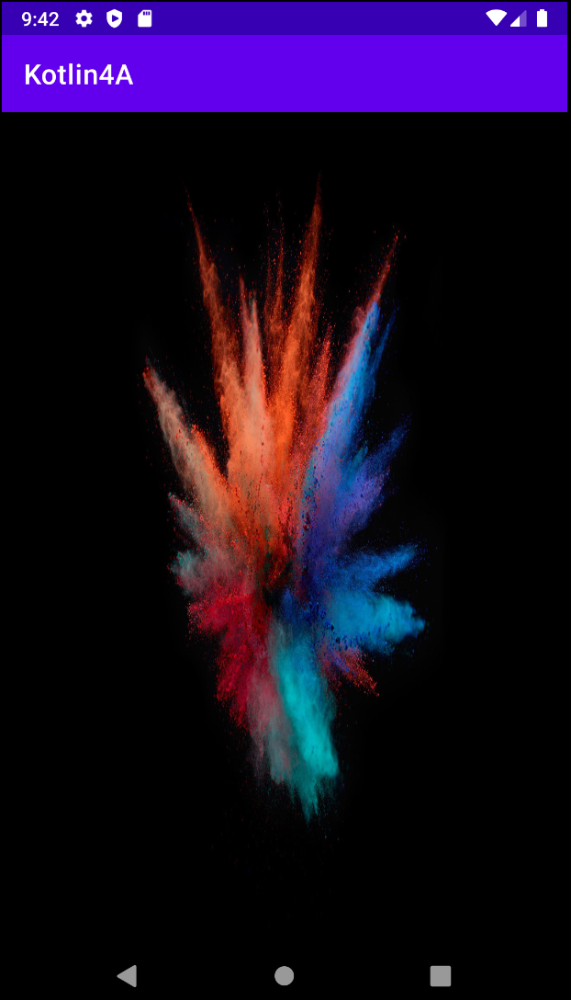
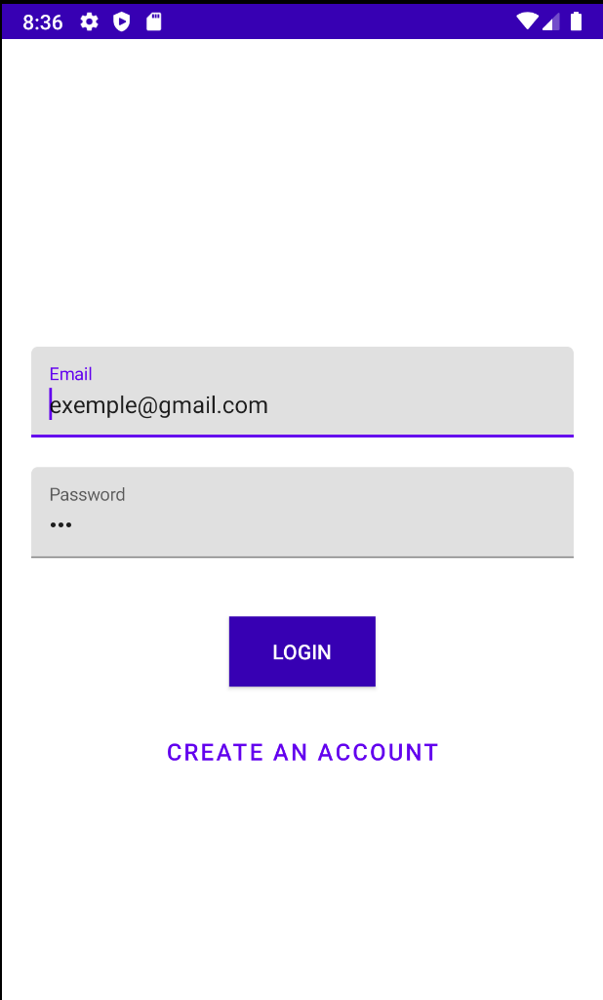
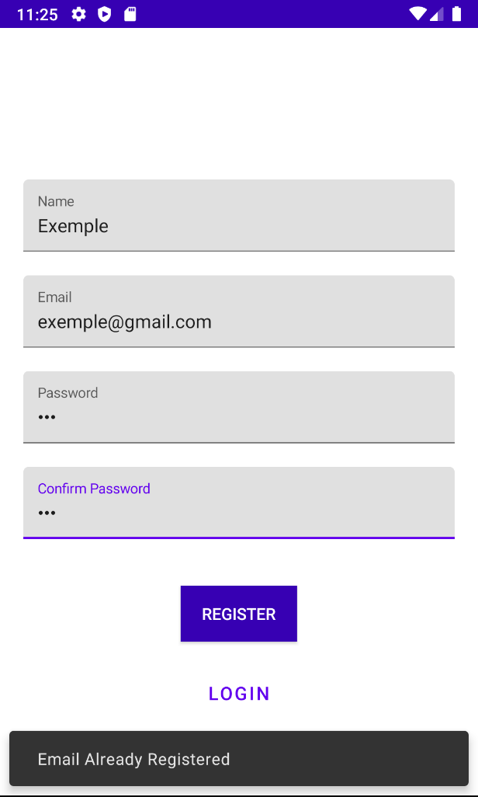

# Kotlin4A

Projet d'application Android Studio sur les équipes de NBA. L'utilisateur doit s'identifier puis se connecter pour avoir accés aux joueurs de l'équipe puis aux détails des joueurs

Cette application utilise une APIRest personnel : https://raw.githubusercontent.com/Alexi911/NBA/master/WarriorsPlayers.json
<br/>

### Pré-requis

- Installer Android Studio </br>
- Ouvrir le projet sur Android Studio </br>
```
git clone https://github.com/Alexi911/NBATeams.git
```
### Clean Architecture

</br>
<u>Image Source : https://blog.cleancoder.com/uncle-bob/images/2012-08-13-the-clean-architecture/CleanArchitecture.jpg</u>

### Résumé

- Clean Architecture</br>
- SplashScreen </br>
- SplashScreen </br>
- Utilisation de RecyclerView </br>
- Récupération et affichage des détails des joueurs </br>
- Appel à un webService - APIRest </br>
### Captures d'écrans

#### SplashScreen
<p align="center" width="100%">
    
</p>


#### Login Screen 
<p align="center" width="100%">
    
</p> </br>

#### Create An Account 
<p align="center" width="100%">
    
</p>
<p align="center" width="100%">
    
</p>

#### Login
<p align="center" width="100%">
    
</p>

#### Team
<p align="center" width="100%">
    
</p>

#### Player Details
<p align="center" width="100%">
    
</p>

#### Reported Errors
<p align="center" width="100%">
    
</p>

<p align="center" width="100%">
    
</p>

<p align="center" width="100%">
    
</p>

<p align="center" width="100%">
    
</p>

<p align="center" width="100%">
    
</p>

<p align="center" width="100%">
    
</p>


